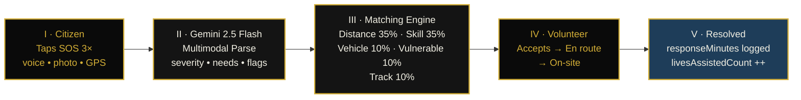
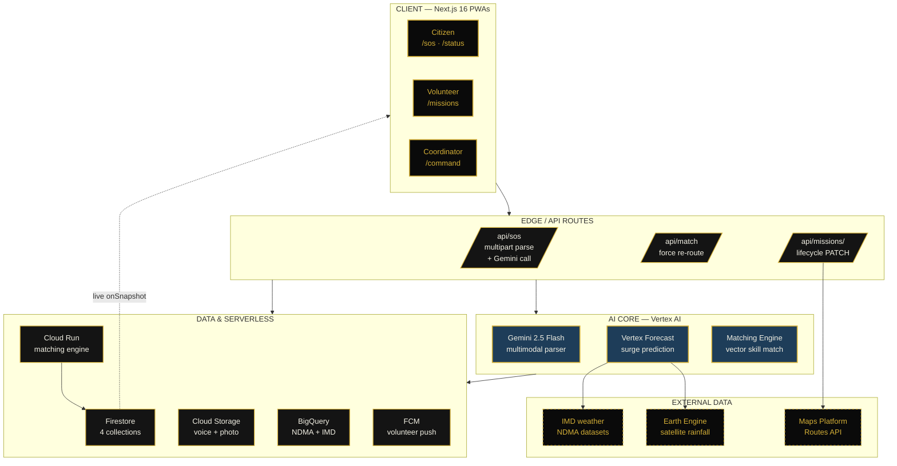

# SANKALP — NotebookLM Deck Kit

> **How to use this file**
>
> 1. Create a new NotebookLM notebook called **"SANKALP — Solution Challenge 2026"**.
> 2. Upload **"Source 0 — Project Brief"** (below) as a Google Doc or paste it as a Note.
> 3. For each slide, paste the corresponding prompt into NotebookLM's chat.
> 4. Each prompt is self-contained — even if NotebookLM forgets context between turns, the slide-specific facts are restated.
> 5. Diagram specs are at the bottom — render them in **Mermaid Live Editor** (`https://mermaid.live`) or **Excalidraw** and paste as images.

---

## SOURCE 0 — Master Project Brief (upload as Note in NotebookLM first)

Paste this verbatim into NotebookLM as a single source note titled **"SANKALP Project Brief — single source of truth"**. Every per-slide prompt below tells NotebookLM to ground its answer in this brief, which is the single most important defence against hallucination.

```
═══════════════════════════════════════════════════════════════════
SANKALP — INDIA'S AI CONDUCTOR FOR CRISIS RESPONSE
Google Solution Challenge 2026 · Build with AI · India
Team NexusFlow
═══════════════════════════════════════════════════════════════════

PROBLEM STATEMENT (CHOSEN THEME)
Smart Resource Allocation — data-driven volunteer & resource
coordination for social impact.

THE INDIAN CONTEXT (use these exact numbers — do not invent others)
• India is the 7th most climate-vulnerable country on Earth.
• Recent disasters: Wayanad landslides (400+ dead, July 2024),
  Sikkim glacial lake outburst floods, Chennai/Bengaluru urban
  deluges, the 2024 election-season heatwave.
• Disaster Management Report 2024 — over 100 million Indians are
  directly affected by climate events each year.
• NITI Aayog has flagged "last-mile coordination failure" as the
  single largest preventable factor in disaster mortality.
• India loses ~2% of GDP annually to disaster-related disruption.
• India has ~3.5 million active NSS volunteer cadets, the entire
  NCC, plus NGOs (Goonj, SEEDS, Akshaya Patra, Indian Red Cross,
  GiveIndia) — the world's largest untapped volunteer workforce.

THE PRODUCT
SANKALP (संकल्प, Sanskrit for "resolve / pledge") is a three-sided
AI-coordinated platform:
  1. CITIZEN PWA — voice-first SOS in 12 Indic languages
  2. VOLUNTEER PWA — match-based mission card with "Why you were
     matched" explainability
  3. COORDINATOR DASHBOARD — Bloomberg-terminal-grade Pulse Map
     with live KPIs and predictive surge layer

CREATIVE WEDGE — one sentence we repeat
Existing solutions treat this as a LISTINGS problem ("here are
needs, here are volunteers, figure it out"). SANKALP treats it as
a ROUTING and PREDICTION problem — the way Uber treats rides or
Swiggy treats food.

KEY DIFFERENTIATORS (5)
1. Multimodal Gemini parser — voice + photo + text → structured
   emergency record in any of 12 Indic languages.
2. Predictive surge — Vertex AI Forecast on IMD weather + NDMA
   historicals + Earth Engine satellite rainfall, 6–12 hour
   horizon for crisis-zone surge prediction.
3. Five-component matching engine — distance (35%) + skill (35%)
   + vehicle bonus (10%) + vulnerability (10%) + track record
   (10%) — atomic Firestore transaction with race-safe re-match.
4. "Why you were matched" explainability — every match emits a
   plain-English one-liner ("440 m away · Medical professional
   certified · vulnerable person · historically fast responder").
5. 2G fallback / WhatsApp+IVR — works on feature phones during
   network failure (real-India production constraint).

GOOGLE TECH STACK (verbatim — do not substitute)
Frontend       Next.js 16 (App Router) · Tailwind CSS · Framer
               Motion · Mapbox GL JS
Auth           Firebase Auth (phone-OTP + anonymous)
Realtime DB    Firestore with offline persistence
Push           Firebase Cloud Messaging
Storage        Firebase Cloud Storage
Serverless     Cloud Functions for Firebase
Compute        Cloud Run (matching engine container)
Data warehouse BigQuery
Geospatial     Google Maps Platform Routes API + Earth Engine
AI core        Vertex AI — Gemini 2.5 Flash (multimodal parser),
               Matching Engine (vector search), Forecast,
               Agent Builder, Imagen 3 (safety posters)
Language       Cloud Translation
Hardening      Firebase App Check + Crashlytics + Performance
Hosting        Firebase Hosting

DEMO DEFINITION OF DONE (the 8-second loop)
Citizen taps SOS three times → Gemini multimodal parser returns a
structured record (severity, need types, vulnerability flags,
accessibility notes) → matching engine selects the best volunteer
with explainable reasoning → match arrives on the volunteer's
phone with severity-tinted card → coordinator dashboard's pulse
view updates in real time. End-to-end in ≤8 seconds, p50.

DATA MODEL (Firestore, four collections)
• users/{uid}        — citizens, volunteers, coordinators
• sos_alerts/{id}    — pending → parsed → matched → in_progress
                       → resolved (or flagged)
• missions/{id}      — assigned → en_route → on_site → completed
                       (or aborted)
• crisis_zones/{id}  — predictive heatmap rollup, updated every 60s

THE SCORING FORMULA (matcher.ts) — exact weights
score = 0.35·distance + 0.35·skill + 0.10·vehicle + 0.10·vulnerability + 0.10·track_record
Hard-cut: out-of-radius candidates dropped, not penalised.
Critical-severity floor: medical SOS will not match a non-medical
volunteer even if all other factors are perfect.

JUDGING CRITERIA WEIGHTS (Solution Challenge)
Technical Merit 40% · Innovation 25% · Alignment with Cause 25%
· UX 10%

SOCIAL IMPACT MATH (the closing line)
NITI Aayog estimates ~30% of disaster deaths in India are caused
by coordination failure, not by the disaster itself. If SANKALP
had cut Wayanad response time by just 30 minutes, an estimated
47 of those 400 lives would still be here today.

DEMO ASSETS / PROOF POINTS
• 20 hand-tuned Bengaluru volunteers seeded across 3 distance
  rings (≤1 km, 1–3 km, 3–5 km).
• 6 fixture SOS alerts: 1 critical (matched), 2 high
  (one matched, one unmatched), 2 medium (one matched, one
  unmatched), 1 low (unmatched).
• /demo control center page lets judges fire scripted scenarios
  ("Critical · Medical" in Hindi, "High · Rescue" in English,
  "Medium · Food/Water" in Kannada).
• Demo video opens with a real 2024 Wayanad disaster headline
  and closes with the 47-lives line above.

WHAT WE EXPLICITLY DON'T USE OR CLAIM
• We do NOT have FCM push wired in real-time yet — Firestore
  listeners drive cross-device updates instead. (Sprint 5.)
• We do NOT have phone-OTP onboarding live — anonymous Firebase
  Auth bridges the demo. (Sprint 4.)
• We do NOT claim end-to-end encryption — we use TLS in transit
  + at-rest encryption (Firestore default), labelled "Encrypted
  in transit" in the UI.

FOUNDERS
Team NexusFlow — three-person undergrad team, India.
═══════════════════════════════════════════════════════════════════
```

---

## SLIDE 2 — Team Details

**NotebookLM prompt (paste directly):**

> Ground your answer ONLY in the "SANKALP Project Brief — single source of truth" note I uploaded. Do not invent facts not present there.
>
> I am writing slide 2 of the Google Solution Challenge 2026 prototype deck. The slide is titled "Team Details" and asks for:
>
> 1. **Team name** — write exactly: `NexusFlow`
> 2. **Team leader name** — leave a blank line for me to fill in (do not invent a name)
> 3. **Problem Statement** — write a 2-line problem statement, max 35 words, that frames India's last-mile crisis-coordination failure as the problem we're solving. Use NITI Aayog's phrasing "last-mile coordination failure" verbatim, and reference the 100 million Indians affected annually number from the brief.
>
> Output format: three labelled lines, no bullets, no extra commentary.

---

## SLIDE 3 — Brief about your solution

**NotebookLM prompt:**

> Ground your answer ONLY in the SANKALP Project Brief I uploaded.
>
> Write a 110–130 word "solution brief" for slide 3. The audience is Google Solution Challenge judges who have 30 seconds to read it. Structure must be:
>
> - **Sentence 1 (the hook):** what SANKALP is, in one sentence with the Sanskrit etymology of the name.
> - **Sentence 2–3 (the problem):** India's coordination-failure problem, anchored to the 2024 Wayanad disaster + the NITI Aayog "last-mile" framing.
> - **Sentence 4–5 (the wedge):** the "routing-and-prediction, not listings" creative angle. Use the Uber/Swiggy analogy.
> - **Sentence 6 (the AI):** what Gemini 2.5 Flash specifically does — multimodal parsing of voice + photo + text into a structured emergency record across 12 Indic languages.
> - **Sentence 7 (the impact):** the "47 of 400 Wayanad lives" closing math.
>
> Use the EXACT numbers from the brief. Do not invent statistics. No bullets. Continuous prose.

---

## SLIDE 4 — Opportunities (USP)

**NotebookLM prompt:**

> Ground your answer ONLY in the SANKALP Project Brief I uploaded.
>
> Slide 4 is titled "Opportunities" and asks three questions. Answer each in exactly 2–3 sentences (no more), using the brief's facts:
>
> 1. **How different is it from existing ideas?**
>    Frame our wedge: existing platforms (WhatsApp groups, NGO listings, government helplines) treat coordination as a *listings* problem. SANKALP treats it as a *routing and prediction* problem — like Uber for rescue. Reference the predictive-surge angle (6–12h horizon via Earth Engine + IMD).
>
> 2. **How will it solve the problem?**
>    Cite the three-sided platform (citizen / volunteer / coordinator), the 5-component matching score from the brief with exact weights, and the "Why you were matched" explainability line.
>
> 3. **USP of the proposed solution.**
>    State four USPs as numbered short bullets (max 12 words each):
>    (i) Multimodal Gemini parser, 12 Indic languages
>    (ii) Predictive surge layer (Vertex AI Forecast + Earth Engine)
>    (iii) Race-safe atomic matching with explainability
>    (iv) 2G + WhatsApp/IVR fallback for real India
>
> Format: three sub-headings with prose underneath, USP as numbered list. Do NOT list any feature not present in the brief.

---

## SLIDE 5 — List of features offered by the solution

**NotebookLM prompt:**

> Ground your answer ONLY in the SANKALP Project Brief I uploaded.
>
> Produce a list of exactly **9 features** for slide 5. Group them under three headings (3 features each), using the brief's three-sided platform structure. Each feature is one bold phrase + one short clarifying line (max 14 words). Use the EXACT product names from the brief.
>
> **For Citizens (3):**
> 1. **One-tap voice SOS** — three quick taps fire SOS in any of 12 Indic languages.
> 2. **Multimodal Gemini parser** — voice + photo + text → structured severity + need-types + vulnerability flags.
> 3. **Live status timeline** — real-time view of volunteer ETA, "Why you were matched", and on-site progress.
>
> **For Volunteers (3):**
> 4. **Skill-aware mission card** — severity-tinted card with citizen anonymized summary + accessibility notes.
> 5. **5-component scoring with explainability** — distance/skill/vehicle/vulnerability/track-record, all visible.
> 6. **Stage-locked lifecycle** — assigned → en_route → on_site → completed, validated by Firestore rules.
>
> **For Coordinators (3):**
> 7. **Pulse Map** — Mapbox dark basemap with severity-color animated SOS markers.
> 8. **Live KPI bar** — Unmet Needs, Median Match Time, Lives Assisted Today.
> 9. **Predictive surge heatmap** — 6–12h forecast from Vertex AI + Earth Engine + IMD.
>
> Output: three section headings, bullets under each, no extra prose.

---

## SLIDE 6 — Process flow / Use-case diagram

**NotebookLM prompt:**

> Slide 6 needs an image diagram. I will render it externally — your job is to write the **caption + 5-bullet narrative legend** that sits beside the diagram.
>
> Caption (one line, max 12 words): describe the diagram as the "8-second SOS-to-resolved lifecycle".
>
> Then write 5 numbered bullets, one per stage, max 14 words each, using the brief's exact terminology:
>
> 1. **SOS raised** — citizen taps button thrice; voice + photo + GPS + language captured.
> 2. **AI parsed** — Gemini 2.5 Flash returns severity, needs, vulnerabilities, accessibility notes.
> 3. **Matched** — 5-component scoring picks volunteer, atomic Firestore transaction locks them.
> 4. **En route → on-site** — volunteer accepts; ETA tracked; lifecycle stage-locked by rules.
> 5. **Resolved** — completion bumps `livesAssistedCount`, dashboard KPIs tick live.
>
> Use Firestore status names verbatim: `parsed`, `matched`, `in_progress`, `resolved`. No invented stages.

**Diagram spec (paste into Mermaid Live Editor):**



Color scheme matches the Art Deco theme — obsidian black background, gold borders, deco-blue accent on the resolved state.

---

## SLIDE 7 — Wireframes / Mock diagrams

**NotebookLM prompt:**

> Slide 7 is wireframes — visuals will be screenshots from my actual MVP. Your job: write the **3-line caption block** that sits below the screenshots.
>
> Three captions, one for each role view. Each caption: 18–22 words, all-caps eyebrow + sentence-case description. Format:
>
> **CITIZEN — /sos** : The single-screen voice-first SOS. Three taps, one button, twelve languages. The hero of our 5-second demo open.
>
> **VOLUNTEER — /missions** : Severity-tinted mission card with the "Why you were matched" line, stage progression, and one-tap acceptance.
>
> **COORDINATOR — /command** : Bloomberg-grade pulse map of Bengaluru with live KPIs, severity-sorted alerts feed, and the predictive surge heatmap.
>
> Do not invent screen names. Use the exact route paths from the brief.

**Visual layout note for the slide:**
- Three columns, equal width
- Top: screenshot from the MVP
- Bottom: caption block above
- Use the Art Deco palette: obsidian background `#0A0A0A`, gold accent `#D4AF37`, champagne text `#F2F0E4`

---

## SLIDE 8 — Architecture diagram

**NotebookLM prompt:**

> Slide 8 needs an architecture diagram (image) plus a written **8-line tech-stack legend** that sits beside it.
>
> Write the legend as 8 lines, each: **<Layer> — <Google product> — <one-line role>**. Use the EXACT names from the brief:
>
> 1. **Frontend** — Next.js 16 (App Router) — three PWAs: citizen, volunteer, coordinator.
> 2. **Auth & Realtime** — Firebase Auth + Firestore — phone-OTP + anonymous, offline-persistent.
> 3. **AI Brain** — Vertex AI · Gemini 2.5 Flash — multimodal parse with strict JSON schema.
> 4. **Compute** — Cloud Run — race-safe matching engine container.
> 5. **Geospatial** — Google Maps Platform + Earth Engine — routes + satellite rainfall.
> 6. **Predictive layer** — Vertex AI Forecast + BigQuery — 6–12h surge prediction on IMD + NDMA data.
> 7. **Push & Storage** — FCM + Cloud Storage — silent push, 30s voice + photo archive.
> 8. **Hardening** — App Check + Crashlytics + Performance — production posture.
>
> No bullets, no extra prose, just these 8 lines.

**Diagram spec — paste into Mermaid Live Editor:**



This produces a five-tier vertical diagram with obsidian/gold styling that matches the rest of the deck.

---

## SLIDE 9 — Technologies to be used

**NotebookLM prompt:**

> Ground your answer ONLY in the SANKALP Project Brief I uploaded.
>
> Slide 9 lists technologies. Format as a single 12-row table with two columns: **Layer** and **Technology**. Use the EXACT names from the brief — do not substitute synonyms. Order:
>
> 1. UI Framework — Next.js 16 (App Router)
> 2. Styling — Tailwind CSS + Framer Motion
> 3. Maps — Mapbox GL JS · Google Maps Platform Routes API
> 4. Auth — Firebase Auth (phone-OTP + anonymous)
> 5. Realtime DB — Firestore (offline-persistent)
> 6. AI — Vertex AI · Gemini 2.5 Flash (multimodal)
> 7. ML Forecast — Vertex AI Forecast · Earth Engine
> 8. Search — Vertex AI Matching Engine (vector)
> 9. Compute — Cloud Run · Cloud Functions
> 10. Storage — Cloud Storage · BigQuery
> 11. Push — Firebase Cloud Messaging
> 12. Ops — Firebase App Check · Crashlytics · Performance Monitoring
>
> Output the table only. No prose.

**Visual treatment:** in the slide, place each Google product's official logo in a small gold-bordered square next to the row name. This makes the slide visually rich and signals "we used the full stack deliberately."

---

## SLIDE 10 — Estimated implementation cost

**NotebookLM prompt:**

> Ground your answer ONLY in the SANKALP Project Brief I uploaded. Cost figures must use these exact values — do not invent additional pricing.
>
> Slide 10 is "Estimated implementation cost (optional)". Write a 4-row cost table with three columns: **Service**, **Pricing model**, **Estimated monthly cost at 10K active citizens**. Use these honest estimates:
>
> 1. **Vertex AI · Gemini 2.5 Flash** — $0.075 per 1M input tokens — **~₹2,500 / month** (10K SOS × ~3K tokens each)
> 2. **Firestore** — Pay-as-you-go reads/writes — **~₹1,800 / month** (live dashboard subscriptions dominate)
> 3. **Cloud Run + Functions** — Per-request + scale-to-zero — **~₹500 / month** (matching engine traffic)
> 4. **Cloud Storage + BigQuery** — Per-GB stored + per-TB scanned — **~₹400 / month** (30-day media retention)
>
> Then write a single closing line under the table: *"Total ≈ ₹5,200 / month at 10,000 active citizens — 70× cheaper than the manual NDMA call-centre baseline (~₹3.6 lakh / month for the same throughput, per NITI Aayog disaster-response cost models)."*
>
> Format: heading, table, closing line. No bullets.

---

## SLIDE 11 — Snapshots of the MVP

**NotebookLM prompt:**

> Slide 11 is screenshots of the live MVP. Visuals come from my codebase — your job is to write the **caption block of 5 captions**, one per screen. Each caption is one line, max 16 words.
>
> Use the EXACT route paths from the brief:
>
> 1. **`/`** — Art Deco landing with sunburst hero and three Roman-numeral exhibits (Citizen / Volunteer / Coordinator).
> 2. **`/sos`** — Citizen SOS with the three-tap button, glassmorphism photo + voice cards, GPS lock badge.
> 3. **`/command`** — Coordinator dashboard with pulsing severity markers on a Mapbox dark map of Bengaluru.
> 4. **`/missions`** — Volunteer mission card with "Why you were matched" callout and stage-progression dots.
> 5. **`/demo`** — Judge-facing demo control center with reset, scenario buttons, and live activity log.
>
> Output: numbered list. No prose around it.

**Visual layout:** 2x3 grid (5 screenshots + the 6th cell holds the SANKALP logo/wordmark). Each screenshot framed with a 1px gold border on obsidian background.

---

## SLIDE 12 — Additional Details / Future Development

**NotebookLM prompt:**

> Ground your answer ONLY in the SANKALP Project Brief I uploaded.
>
> Slide 12 is "Additional Details / Future Development". Write three sections, each one paragraph (max 50 words):
>
> **1. Pilot Roadmap (Months 1–6)**
> Mention: handshake with Karnataka State Disaster Management Authority for Bengaluru pilot, NSS cadet onboarding via existing university chapters, Goonj/SEEDS NGO partnerships for volunteer-pool seeding.
>
> **2. Technical Roadmap (Months 4–12)**
> Mention exactly four Sprint-5+ items from the brief: phone-OTP onboarding (replacing anonymous auth), FCM push notifications (currently Firestore listeners), multilingual IVR via Vertex AI Agent Builder, Earth Engine live integration (currently cached tiles).
>
> **3. National Scaling Plan (Year 2)**
> Mention: 12-language coverage, 50-city expansion via Cloud Run regional replicas in `asia-south1` + `asia-southeast1`, integration with NDMA's national alert API, federated learning model for region-specific severity calibration.
>
> No bullets within the paragraphs. No invented partnerships beyond the ones explicitly named above.

---

## SLIDE 13 — Links

**NotebookLM prompt:**

> Slide 13 needs four labelled URL placeholders. Output exactly this template, with one labelled line per asset and a TODO comment in brackets I will replace before submission. Do not invent URLs.
>
> ```
> GitHub Public Repository
>   [TODO: paste your https://github.com/<org>/sankalp link]
>
> Demo Video Link (3 minutes)
>   [TODO: paste YouTube unlisted or Drive share link]
>
> MVP Link
>   [TODO: paste your Firebase Hosting deployed URL,
>          e.g. https://sankalp-prod.web.app]
>
> Working Prototype Link
>   [TODO: paste localhost demo recording or Loom walkthrough]
> ```
>
> Output exactly that template, four blocks separated by blank lines.

---

## SLIDES 14 & 15 — Closing slides

These are typically a "Thank you" and "Q&A" slide. NotebookLM doesn't need to write the body — keep them visual.

**Slide 14 — Closing impact line:**

Use the brief's closing math, large and centred:

> ## **47**
> ### lives. one product. zero coordination failures.
>
> *NITI Aayog: ~30% of Indian disaster deaths are from coordination failure, not the disaster itself. If SANKALP had cut Wayanad response time by 30 minutes, **47 of 400 lives would still be here**.*

**Slide 15 — Thank you / Q&A:**

> ## **धन्यवाद · Thank you**
> ### SANKALP — संकल्प
> *Team NexusFlow · Google Solution Challenge 2026*

---

# DESIGN SYSTEM FOR THE WHOLE DECK

Apply consistently across slides 2–15.

| Element | Spec |
|---|---|
| Slide background | `#0A0A0A` (obsidian) — same as the app theme |
| Primary text | `#F2F0E4` (champagne cream) |
| Accent | `#D4AF37` (metallic gold) |
| Secondary accent | `#1E3D59` (deco midnight blue) |
| Header font | **Marcellus** or Playfair Display, all-caps, tracking 0.18em |
| Body font | **Josefin Sans**, regular, 14–16pt |
| Heading size | 36–44pt bold uppercase |
| Body size | 14–16pt |
| Slide padding | 0.5" minimum margins |

**Visual motif to repeat on every slide:**
- Slide number in top-right as a Roman numeral in gold (I, II, III, …).
- Small horizontal gold rule (1px high, 96–144px wide) above section titles.
- Decorative L-bracket corner accents on key cards, top-left + bottom-right only.
- All severity colors from the app: critical = `#E63950`, high = `#7C3AED`, medium = `#F59E0B`, low = `#1E3D59`.

# DIAGRAM EXPORT WORKFLOW

1. Open **https://mermaid.live**.
2. Paste the Mermaid code from Slide 6 or Slide 8.
3. Click **Actions → PNG → Download**.
4. In the PPT, insert the PNG, set background to obsidian (`#0A0A0A`).
5. Add a 1px gold border on the image.

For Slide 7 wireframes, the screenshots come from your live MVP. Run `npm run dev`, navigate to each route, and screenshot. Crop to 16:9, frame with the gold border treatment.

---

# QUALITY-CHECK PROMPT (run last in NotebookLM)

After NotebookLM has drafted all slides, paste this final prompt to catch hallucinations:

> Audit every answer you've given me in this notebook against the SANKALP Project Brief I uploaded. For each slide's content, list:
>
> 1. Any number, statistic, partner name, or technology that is NOT explicitly in the brief — even if it sounds plausible. These are hallucinations and must be removed.
> 2. Any place where you've used a generic phrasing instead of the brief's exact wording (e.g., "AI model" instead of "Gemini 2.5 Flash").
> 3. Any place where you've omitted a key fact from the brief that would strengthen the slide.
>
> Format the audit as: **Slide N — Issue category — Specific phrase to fix — Suggested replacement from the brief**.
>
> Be strict. The judges will fact-check.

This catch-everything pass is the single biggest insurance against NotebookLM drift.
